<h1 align="center">Riemann &amp; Sons</h1>
<p align="center"><em>Fine deformations of spaces.</em></p>
<p align="center">
A differentiable Riemannian-geometry research toolkit in PyTorch.<br>
<b>Construct a geometry, inspect it, manipulate it, evolve it, and study what happens to objects living in it.</b>
</p>

<p align="center">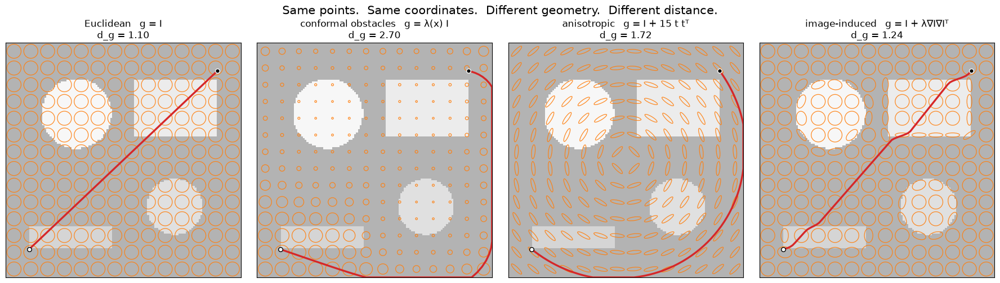</p>

Modern AI is vector-native (embeddings, vector databases, RAG, latent spaces, hidden states), yet
almost everything downstream measures those vectors with cosine similarity or Euclidean distance.
Riemann & Sons makes the **geometry itself programmable and learnable**: a metric tensor `g(x)`
is a PyTorch module, every derived quantity (Christoffel symbols, curvature, geodesics, Laplace–Beltrami,
distances, retrieval) is obtained from it by automatic differentiation, and gradients flow back to
the metric's parameters.

Everything starts in 2-D, where geometry can be *looked at*. The image experiments are not the point;
they are the microscope.

> **The image is not the object being modeled geometrically. The image is a field living on a space whose geometry can be changed.**

---

## Three separate things

```
   Representation            Geometry                    Operation
   (field, image,     ×      (M, g)              →       (geodesic, diffusion,
    point cloud)              programmable                retrieval, warp, ...)
```

```python
import riemann_and_sons as rn

image    = rn.Image.from_file("scene.png", grayscale=True)         # a field  I : M → R
geometry = rn.Geometry(rn.Plane(), rn.EuclideanMetric())           # (M, g)
blurred  = rn.diffuse(image, geometry, t=0.002)                    # ∂ₜI = Δ_g I

# same image, different geometry, different operation result
geometry = geometry.with_metric(rn.image_induced_metric(image, lam=0.02, sigma=1.5))
edge_aware = rn.diffuse(image, geometry, t=0.002)
```

Changing the geometry never requires changing the object living on it.

---

## Demo A · construct a geometry by hand

Same scene, three geometries. Rows: Euclidean `g = I`; conformal obstacles `g = λ(x) I` with λ ≫ 1 on
the shapes; a radially anisotropic metric `g = I + 15 t tᵀ` (a cone: flat everywhere except at the apex).
Columns: metric unit balls `vᵀ g v = 1` with geodesics, geodesic distance field from ★, scalar curvature.

<p align="center">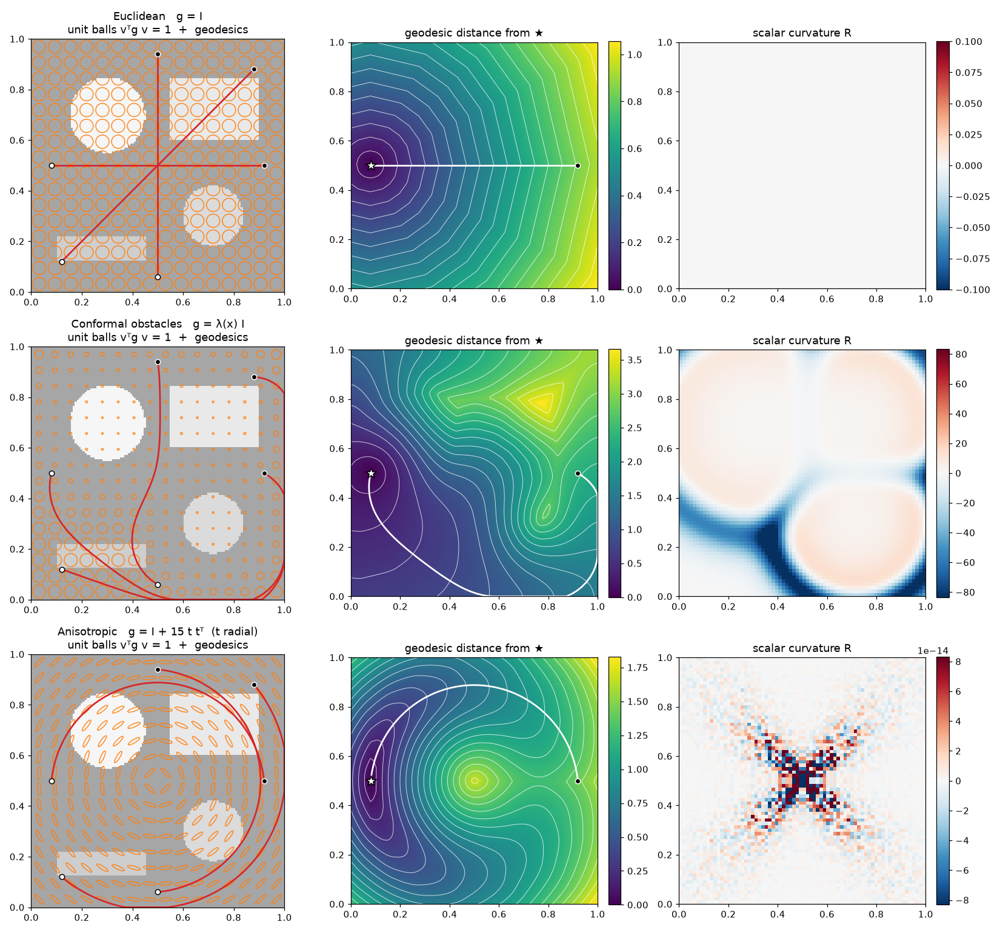</p>

## Demo B · image-induced geometry

`Image → metric field → geodesics → distance field → geometric operation`. The metric is the structure
tensor `g_I = I + λ ∇I_σ ∇I_σᵀ`: crossing an edge costs `√(1 + λ|∇I|²)` per unit length, sliding along it
costs 1. Geodesics route around edges, distance contours bend at boundaries, and diffusion under `Δ_g`
no longer leaks across them.

<p align="center">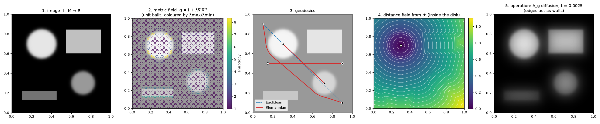</p>

## Demo C · geometry-dependent diffusion

The same image and the same times under `∂ₜI = ΔI` (top), the image-induced metric (middle) and a
conformal wall metric with a gap (bottom). Nothing about the image changed; the geometry did.

<p align="center">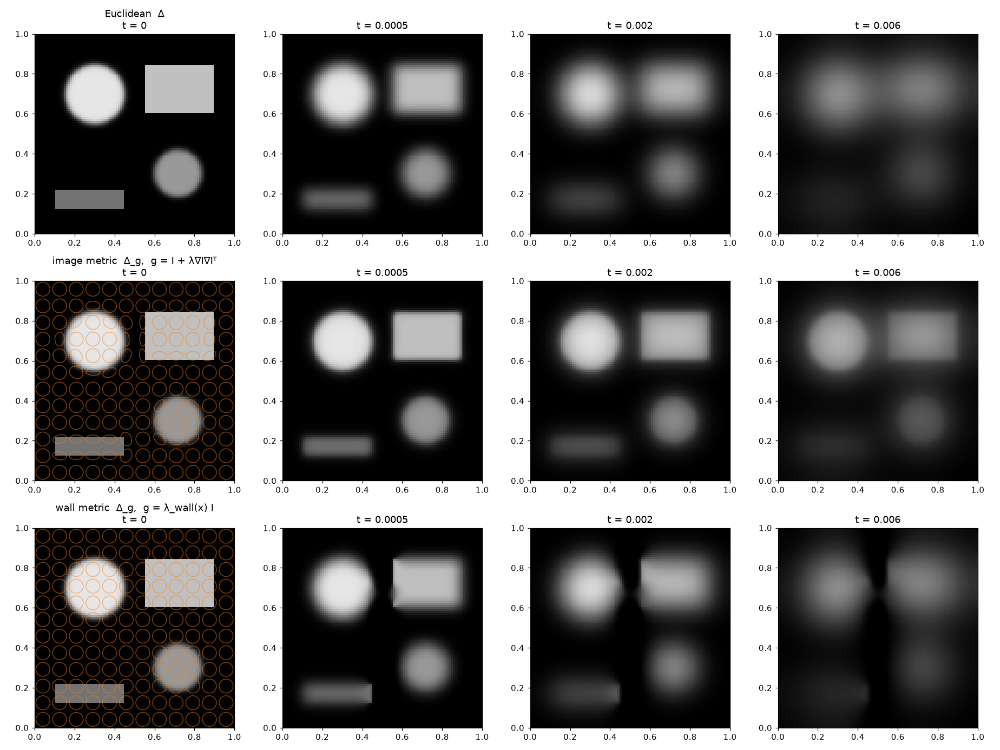</p>

## Demo D · smooth transformations from constraints, Jacobians first-class

Landmark pairs → smooth `Φ : M → M` (thin-plate spline, or a B-spline displacement fitted with bending
and fold penalties) → `I'(x) = I(Φ⁻¹(x))` by inverse sampling. `det J_Φ` is a heatmap; the third row is
deliberately over-constrained and the region with `det J ≤ 0` is hatched.

<p align="center">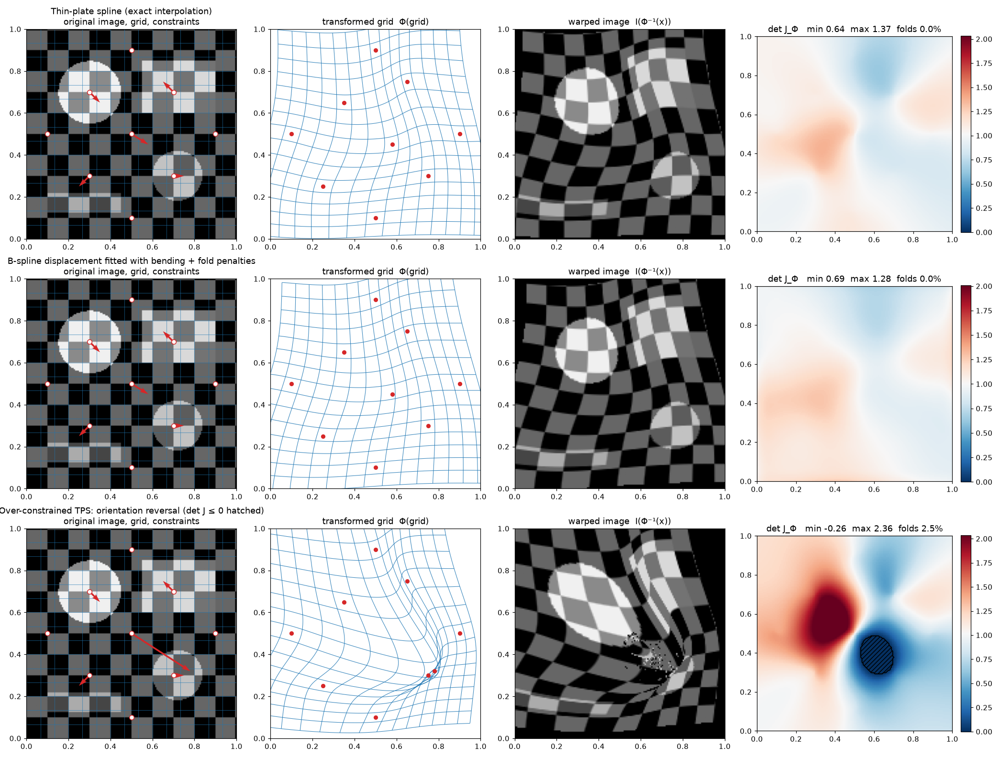</p>

## Demo E · watch a 2-D metric being learned

Two noisy moons, triplet supervision `(x, x⁺, x⁻)`, a 16×16 grid of SPD matrices interpolated with cubic
B-splines, hinge loss on Riemannian distances plus regularisers. Ellipses stretch along the class
boundary so crossing it becomes expensive.

<p align="center">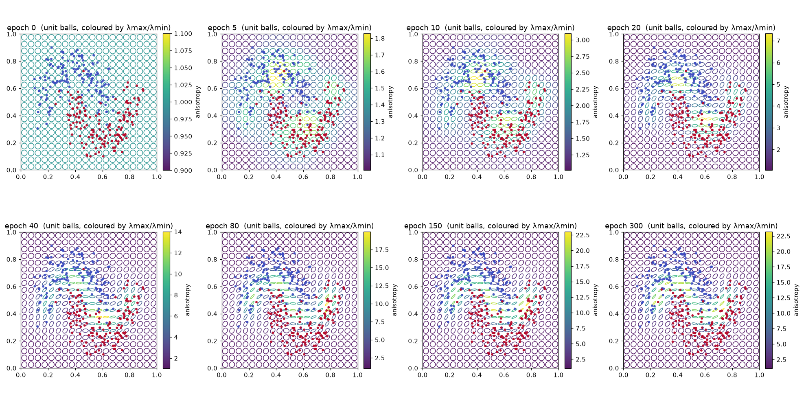</p>
<p align="center">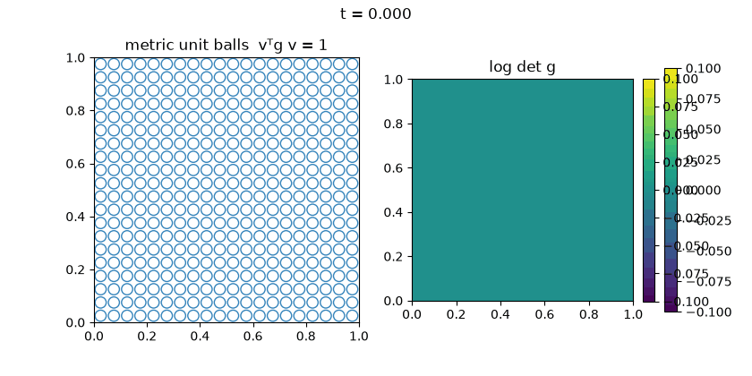</p>
<p align="center">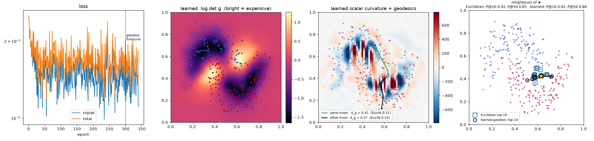</p>

## Demo F · the visual retrieval laboratory

Euclidean vs learned-geodesic top-10 for confused queries, geodesic paths to the hits, iso-distance
contours, and the learned metric field. Distance contours follow the moon instead of forming circles.

<p align="center">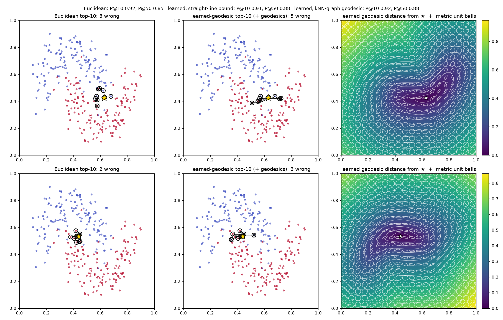</p>

Honest numbers (leave-one-out over 300 points, moons with noise 0.22):

| geometry | P@10 | P@50 |
|---|---|---|
| Euclidean | 0.923 | 0.854 |
| learned metric, straight-line bound | 0.913 | 0.880 |
| learned metric, kNN-graph geodesic | 0.920 | 0.879 |

The learned geometry helps at the scale of the class structure (k = 50) and is a wash at the
noise scale (k = 10). Each additional level of geometric complexity has to earn its place like this.

## Demo G · metric flows: Ricci flow, task-driven flow, hybrid flow

Ricci flow `∂ₜg = −2 Ric(g)` on a flat torus with a conformal bump. Checked against theory: `∫R dA = 0`
at all times (Gauss–Bonnet), volume is conserved, `max|R|` decays. In 2-D `Ric = (R/2) g`, so the flow is a
pointwise conformal rescaling: it smooths curvature and never creates anisotropy.

<p align="center">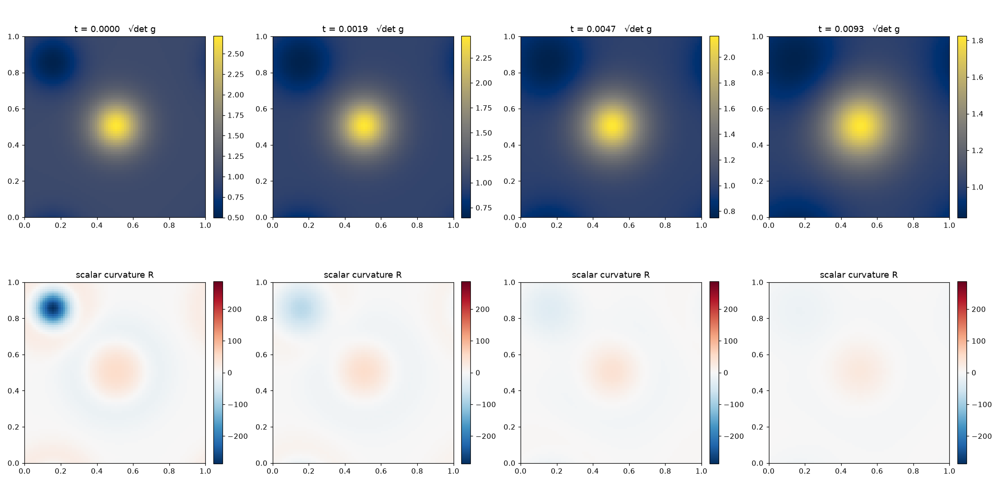</p>
<p align="center">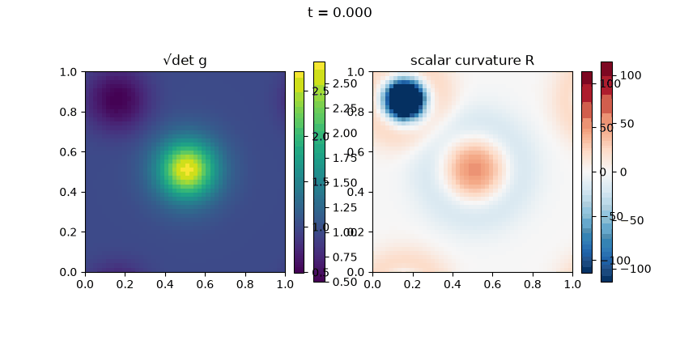</p>
<p align="center">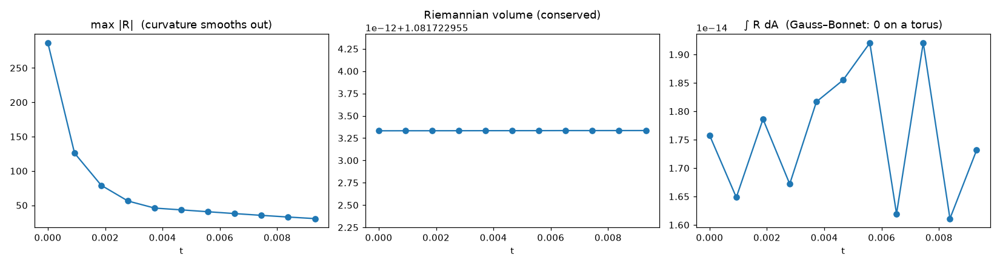</p>

Task-driven flow `dθ/dt = −∇θ E(g_θ)` (the explicit parameter-space form of `∂ₜg = −grad_g E`) and a
hybrid `∂ₜg = −2λ Ric(g) + F_task(g)` by Lie splitting. The Ricci term acts as a curvature regulariser
that fights the task; whether that is useful is an empirical question the toolkit makes testable.

<p align="center">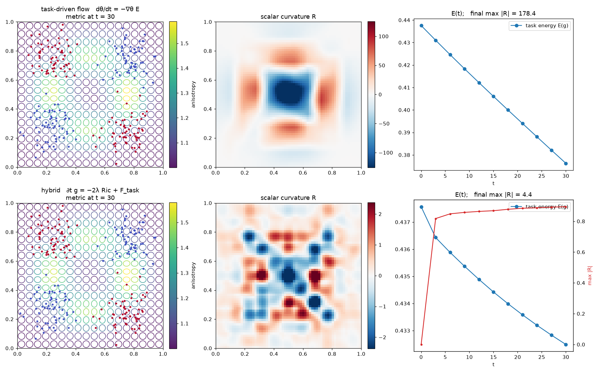</p>

---

## The inspector

```python
insp = rn.Inspector(geometry, field=image)
insp.show(metric=True, det=True, condition=True, curvature=True,
          distance=sources, geodesics=[(a, b)], diffusion=0.002, jacobian=phi)
insp.animate(trajectory, panels=("metric", "curvature"), path="flow.gif")
```

Panels: metric ellipses, `det g`, eigenvalues, condition number, volume element, `‖Γ‖`, scalar
curvature, geodesics, distance fields, diffusion, deformation grids and Jacobians.

---

## What is implemented (v0.1)

| layer | contents |
|---|---|
| **geometry** | `Box` domains (periodic optional); metrics: `EuclideanMetric`, `ConstantMetric` (Mahalanobis), `ConformalMetric`, `FunctionMetric`, `GridMetric` (learnable SPD field, cubic B-spline, `C²`), `PullbackMetric` (`JᵀJ + εI`), `DiagonalLowRankMetric`; SPD parameterisations: Cholesky `LLᵀ + εI`, log-Euclidean, diagonal, conformal, diagonal + low-rank |
| **differential geometry** | `∂g`, Christoffel symbols, Riemann, Ricci and scalar curvature by nested `torch.func.jacfwd` + `vmap`; differentiable w.r.t. metric parameters |
| **operators** | gradient, Riemannian gradient, divergence, Laplace–Beltrami (conservative staggered scheme, Neumann or periodic) |
| **paths** | geodesic ODE / exponential map (RK4), variational boundary-value geodesics (L-BFGS, graph-initialised), parallel transport, Dijkstra geodesic distance fields with 16-connectivity |
| **fields** | `Field`, `Image` (row-major ↔ coordinate conventions handled), sampling, Gaussian blur, Riemannian integrals |
| **flows** | `diffuse` with automatic CFL step; `MetricFlow`, `RicciFlow` (normalised, adaptive sub-steps), `GradientFlow`, `HybridFlow`, `MetricTrajectory` |
| **deformation** | `Affine`, `Displacement` (B-spline), `ThinPlateSpline`, composition, numerical inverses, `jacobian_stats` (det, singular values, condition number, folds), `warp`, bending / fold / landmark energies, `fit_transformation` |
| **learning** | straight-line and variational geodesic distances (both differentiable), triplet loss, regularisers: smoothness `‖∇g‖²`, anisotropy `λmax/λmin`, Euclidean prior `‖g−I‖²`, volume prior `(log det g)²`, curvature `R²`; `fit_metric` |
| **retrieval** | Euclidean, cosine, Mahalanobis, geodesic (grid distance field / kNN graph / straight-line) retrievers with paths; `precision_at_k` |
| **visualisation** | metric ellipses, heatmaps, distance fields, curvature, geodesics, deformation grids, Jacobian maps, `Inspector` |

Every differential-geometry primitive is tested against analytical cases: the unit sphere in polar and
stereographic coordinates (`R = +2`, Christoffel symbols, great circles, holonomy `2π cos θ₀`), the
Poincaré half-plane (`R = −2`, the closed-form distance `arccosh(1 + |Δ|²/2y₁y₂)`, semicircle geodesics),
the paraboloid pullback metric (`K = 4` at the apex), Gauss–Bonnet on the torus, exactness of
`Δ_g` on quadratics for constant metrics, and the conformal factor `Δ_g = e^{−2u} Δ` in 2-D.

## Install

```bash
git clone https://github.com/GHamrouni/Riemann-Sons.git
cd Riemann-Sons
uv venv --python 3.13 && uv pip install -e ".[dev]"     # or: pip install -e ".[dev]"
pytest                                                   # 61 tests
cd examples && python demo_a_manual_geometry.py          # figures land in examples/output/
```

Python ≥ 3.13, PyTorch ≥ 2.4, NumPy, SciPy (sparse Dijkstra), matplotlib. CPU works; CUDA works wherever
PyTorch does. Importing the package sets the default dtype to `float64`: curvature is a second derivative
of an interpolated field and single precision is not adequate for that.

## Conventions

* Points are `(..., n)` tensors; metrics return `(..., n, n)`; coordinate `k` ↔ array axis `k` of any grid.
* `Γ[k, i, j] = Γ^k_ij`, `R[ρ, σ, μ, ν] = R^ρ_σμν`, `Ric_σν = R^ρ_σρν`, `R = g^{σν} Ric_σν`; the unit sphere has `R = +2`.
* Metric unit balls are drawn as `vᵀ g v = 1`: a *short* axis means an *expensive* direction.
* `Path.length(geometry)` re-evaluates the metric along a converged geodesic, so its gradient w.r.t.
  metric parameters is exact to first order (envelope theorem).

See [`docs/mathematics.md`](docs/mathematics.md) for the discretisations and their known limitations,
and [`docs/roadmap.md`](docs/roadmap.md) for where this is going (image embeddings as the bridge to
high dimensions, learned geometry for frozen embeddings, pullback metrics, RAG).

## Status and caveats

This is v0.1 of a research toolkit, not a library with stability guarantees.

* Curvature of a `GridMetric` is the curvature of its B-spline interpolant; it is faithful only at
  scales above the grid spacing. Learned metrics are often rough at the grid scale (large `R`).
* The Dijkstra distance field carries a 1–2 % metrication error; use it for pictures and for
  initialising the variational solver, not as ground truth.
* Ricci flow holds coordinates fixed (no DeTurck gauge) and is meant for compact / periodic 2-D
  experiments.
* Straight-line Riemannian distance is an *upper bound* on geodesic distance; metrics trained on it
  can leave "loopholes" that true geodesics exploit. Fine-tune with `distance="geodesic"`.

## License

MIT.
